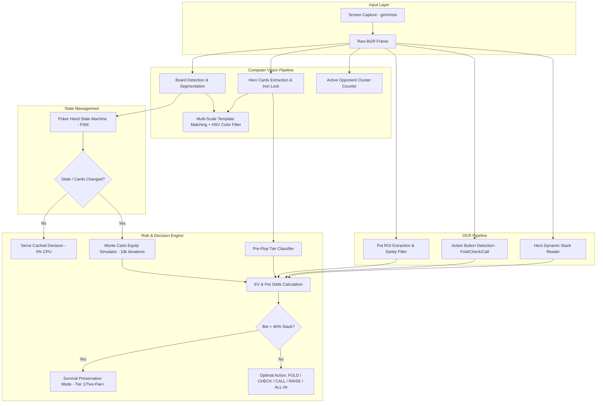

# Real-Time Poker Vision Assistant & Decision Engine (PAE)

[](https://www.python.org/)
[](https://opencv.org/)
[](https://github.com/tesseract-ocr/tesseract)
[](https://numpy.org/)
[](#system-architecture)
[](LICENSE)

An autonomous, low-latency, real-time computer vision assistant and game-theory optimal (GTO) decision engine for Texas Hold'em. 

Built with zero invasiveness (pure visual capture via Linux Wayland/X11 memory buffers and Windows GDI), PAE scans live poker tables, segments hole and community cards via multi-scale normalized cross-correlation, performs dual-pass OCR on stacks and pot sizes, maintains hand state consistency via an explicit Finite State Machine (FSM), and computes real-time Expected Value (EV) via Monte Carlo equity simulations.

---

## Table of Contents
- [Key Features](#key-features)
- [System Architecture](#system-architecture)
  - [1. Computer Vision Pipeline (CV)](#1-computer-vision-pipeline-cv)
  - [2. Optical Character Recognition (OCR)](#2-optical-character-recognition-ocr)
  - [3. Finite State Machine (FSM)](#3-finite-state-machine-fsm)
  - [4. Game Theory & Risk Engine](#4-game-theory--risk-engine)
- [Directory Structure](#directory-structure)
- [Installation Guide](#installation-guide)
  - [Linux (Ubuntu / Debian / Arch)](#linux-ubuntu--debian--arch)
  - [Windows](#windows)
- [Configuration](#configuration)
- [Usage & Execution](#usage--execution)
  - [Autonomous Live Mode](#autonomous-live-mode)
  - [Architectural Validation Suite](#architectural-validation-suite)
  - [Unit Testing](#unit-testing)
- [License](#license)

---

## Key Features

- **Multi-Scale Normalized Template Matching**: Resolves card ranks and suits dynamically between 60% and 150% scaling, supporting any table DPI or card aspect ratio.
- **Chromatic HSV Suit Filtering**: Mathematically segregates red suits (`♥`, `♦`) and black suits (`♠`, `♣`), preventing misclassification under extreme contrast.
- **Morphological Disambiguation**: Topological contour analysis separates visually similar symbols (e.g. Spade apex vs. Club lobes, Diamond apex vs. Heart cavity).
- **Dual-Thresholding OCR with Otsu & Contour Noise Gates**: Crops, scales 2x, binarizes, and removes chip icons or visual noise to reliably extract pot sizes and Hero stacks.
- **Strict Iron Lock Hand Persistence**: Caches Hero cards once recognized with high confidence, preventing single-frame vision glitches from wiping the hand mid-round.
- **Finite State Machine Lifecycle Enforcement**: Guarantees legal Texas Hold'em transitions (`WAITING_HAND` → `PRE_FLOP` → `FLOP` → `TURN` → `RIVER` → `SHOWDOWN`).
- **Pre-Flop Tier & Implied Odds Engine**: Classifies hole cards across 4 strategic tiers and calculates pot odds vs. stack commitment (`is_heavy_bet` filter).
- **Zero-CPU Cache Optimization**: Skips Monte Carlo recalculations when the board, pot, bet, and hole cards remain static between frames.

---

## System Architecture



### 1. Computer Vision Pipeline (CV)
- **Screen Buffer Ingestion**: Native capture using `grim` over shared memory (`/dev/shm`) on Wayland environments, or low-latency memory grabs via `mss` on X11 and Windows.
- **Dynamic Card Localization**: Masks out the board area and scans for candidate rectangular clusters of white pixels (`HSV` saturation < 55, grayscale > 175) to locate Hero cards regardless of seat assignment.
- **Multiscale Matching**: Template matching using normalized cross-correlation (`cv2.TM_CCOEFF_NORMED`) across 25 scale steps from $0.6\times$ to $1.5\times$.

### 2. Optical Character Recognition (OCR)
- **Pot & Stack Extraction**: Tesseract OCR configured with strict character whitelists (`--psm 6 / --psm 7 -c tessedit_char_whitelist=0123456789.,`).
- **Sanity Guardrail (`MAX_REALISTIC_POT`)**: Discards astronomical readings (e.g. concatenated IDs like `93700`) and falls back to previous verified rounds.
- **Contour Noise Masking**: For Hero stacks, identifies contours and removes circular chip icons (`height > 15`, `width < 35`) before invoking Otsu thresholding.

### 3. Finite State Machine (FSM)
- Enforces game-theoretic ordering:
  $$\text{WAITING\_HAND} \longrightarrow \text{PRE\_FLOP} \longrightarrow \text{FLOP} \longrightarrow \text{TURN} \longrightarrow \text{RIVER} \longrightarrow \text{SHOWDOWN}$$
- Illegal forward transitions (such as jumping from `PRE_FLOP` to `RIVER` without community cards) are blocked.

### 4. Game Theory & Risk Engine
- **Expected Value ($EV$) Calculation**:
  $$EV = (P_{\text{win}} \cdot V_{\text{pot}}) - (P_{\text{lose}} \cdot V_{\text{bet}}) + \left(P_{\text{tie}} \cdot \frac{V_{\text{pot}}}{2}\right)$$
- **Pot Odds**:
  $$\text{Pot Odds} = \frac{\text{bet\_to\_call}}{\text{pot\_size} + \text{bet\_to\_call}} \times 100$$
- **Stack Preservation Filter**: When `bet_to_call > 0.4 * hero_stack`, calls require Tier 1 hands pre-flop (e.g. $AA, KK, QQ, JJ, AK$) or $\ge$ Two Pair post-flop.

---

## Directory Structure

```text
POKER/
├── assets/
│   ├── cards/                  # Segmented card slots (slot_1..slot_5)
│   ├── samples/                # Reference table captures (mesa_6.png, etc.)
│   ├── templates/
│   │   ├── crops/              # Debug crops and intermediate assets
│   │   ├── ranks/              # 13 Binarized rank templates (2..A)
│   │   └── suits/              # 4 Official suit templates (s, h, d, c)
│   └── unknown_cards/          # Auto-saved crops when confidence < threshold
├── src/
│   ├── __init__.py             # Root package export
│   ├── config.py               # Centralized configuration & environment loader
│   ├── vision/                 # Computer Vision & Detection Package
│   │   ├── __init__.py
│   │   ├── detector.py         # Board, hero and opponent detection
│   │   ├── vision.py           # Native screen grabbing (Wayland/X11/Win)
│   │   ├── recognizer.py       # Slot verification and corner segmentation
│   │   ├── cards.py            # Board card grid partitioning
│   │   ├── match_contours.py   # Contour-based glyph matching
│   │   ├── match_small.py      # Micro-glyph template matching
│   │   ├── build_templates.py  # Template generation utility
│   │   └── catalog_cards.py    # Unknown card cataloger with MD5 deduplication
│   ├── ocr/                    # OCR & Text Recognition Package
│   │   ├── __init__.py
│   │   └── ocr_reader.py       # Tesseract pot, stack and action button parser
│   └── engine/                 # Rules, Evaluation & Probability Package
│       ├── __init__.py
│       ├── state_machine.py    # Finite State Machine (HandState)
│       ├── risk_engine.py      # EV calculation & decision engine
│       ├── evaluator.py        # 7-card evaluator & Monte Carlo simulator
│       └── preflop_tier.py     # Heuristic 4-tier preflop classifier
├── tests/                      # Automated Unit & Integration Tests
│   ├── __init__.py
│   └── test_preflop_and_ocr.py # OCR sanity & stack survival test cases
├── config.py                   # Root re-export shim
├── main.py                     # Primary Application Entrypoint
├── test_preflop_and_ocr.py     # Root test runner shim
├── requirements.txt            # Python dependencies
├── .env.example                # Example environment variables
└── README.md                   # Technical documentation
```

---

## Installation Guide

### Linux (Ubuntu / Debian / Arch)

1. **System Dependencies** (Python, Tesseract OCR, Grim for Wayland):
   ```bash
   # Ubuntu / Debian
   sudo apt update
   sudo apt install -y python3 python3-pip python3-venv tesseract-ocr grim

   # Arch Linux
   sudo pacman -S python python-pip tesseract grim
   ```

2. **Clone & Setup Virtual Environment**:
   ```bash
   cd ~/Projetos/POKER
   python3 -m venv venv
   source venv/bin/activate
   pip install --upgrade pip
   pip install -r requirements.txt
   ```

### Windows

1. **Install Python 3.10+** from [python.org](https://www.python.org/downloads/). Ensure **Add Python to PATH** is checked.
2. **Install Tesseract OCR**:
   - Download the installer from [UB-Mannheim/tesseract/wiki](https://github.com/UB-Mannheim/tesseract/wiki).
   - Add `C:\Program Files\Tesseract-OCR` to your Windows System `PATH`.
3. **Setup Virtual Environment in PowerShell**:
   ```powershell
   python -m venv venv
   .\venv\Scripts\Activate.ps1
   pip install --upgrade pip
   pip install -r requirements.txt
   ```

---

## Configuration

Customize coordinates and thresholds via `.env` or system environment variables:

```bash
cp .env.example .env
```

| Parameter | Default | Description |
| :--- | :--- | :--- |
| `HERO_IDENTIFIER` | `The_Ment_End` | Player screen name for OCR stack anchoring |
| `POT_ROI_TOP` / `LEFT` | `210`, `850` | Top-left coordinate of the table pot |
| `RANK_THRESHOLD` | `0.68` | Minimum normalized correlation for card ranks |
| `SUIT_THRESHOLD` | `0.68` | Minimum normalized correlation for card suits |
| `MAX_REALISTIC_POT` | `10000.0` | OCR sanity ceiling to reject misread numbers |
| `HEAVY_BET_STACK_RATIO` | `0.40` | Stack ratio triggering preservation mode |
| `POLL_INTERVAL` | `0.5` | Polling frequency in seconds |

---

## Usage & Execution

### Autonomous Live Mode
Monitors the table continuously, detects turn transitions, reads cards/pot/stack in real-time, and prints formatted advice:

```bash
./venv/bin/python main.py --live
```
*Optional poll interval*: `./venv/bin/python main.py --live --poll 0.3`

### Architectural Validation Suite
Runs the 8-stage verification pipeline simulating all hand transitions and edge-cases:

```bash
./venv/bin/python main.py
```

### Unit Testing
Executes unit tests covering OCR sanity limiters and stack-preservation decisions:

```bash
# Run via root runner
./venv/bin/python test_preflop_and_ocr.py

# Or via standard unittest discovery
./venv/bin/python -m unittest discover -s tests
```

---

## License

Distributed under the MIT License. See `LICENSE` for more information.
