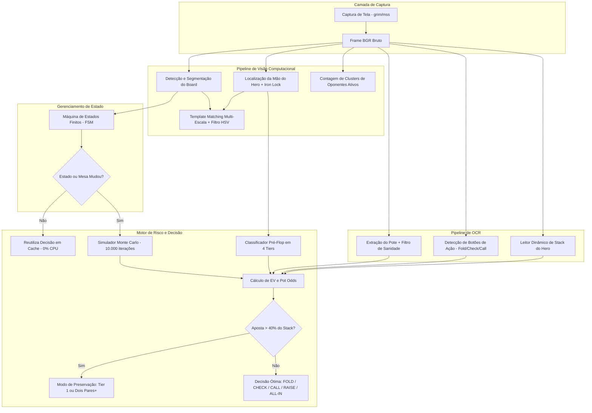

# Real-Time Poker Vision Assistant & Decision Engine (PAE)

[](https://www.python.org/)
[](https://opencv.org/)
[](https://github.com/tesseract-ocr/tesseract)
[](https://numpy.org/)
[](#arquitetura-do-sistema)
[](LICENSE)

Assistente autônomo de visão computacional em tempo real e motor de tomada de decisão com base na Teoria dos Jogos (GTO) para Texas Hold'em.

Construído com **zero invasividade** (captura visual pura via buffers de memória em Linux Wayland/X11 e Windows GDI), o PAE monitora mesas de poker ao vivo, segmenta cartas comunitárias e da mão do Hero via Template Matching multi-escala, executa OCR em dois estágios para extração de potes e stacks, garante a integridade sequencial do jogo através de uma Máquina de Estados Finitos (FSM) estrita e calcula o Valor Esperado (EV) e Pot Odds em tempo real por meio de simulações de Monte Carlo.

---

## Sumário
- [Principais Funcionalidades](#principais-funcionalidades)
- [Arquitetura do Sistema](#arquitetura-do-sistema)
  - [1. Pipeline de Visão Computacional (CV)](#1-pipeline-de-visão-computacional-cv)
  - [2. Pipeline de Reconhecimento Óptico de Caracteres (OCR)](#2-pipeline-de-reconhecimento-óptico-de-caracteres-ocr)
  - [3. Máquina de Estados Finitos (FSM)](#3-máquina-de-estados-finitos-fsm)
  - [4. Motor de Teoria dos Jogos e Análise de Risco](#4-motor-de-teoria-dos-jogos-e-análise-de-risco)
- [Estrutura de Diretórios](#estrutura-de-diretórios)
- [Guia de Instalação](#guia-de-instalação)
  - [Linux (Ubuntu / Debian / Arch)](#linux-ubuntu--debian--arch)
  - [Windows](#windows)
- [Configuração (.env)](#configuração-env)
- [Uso e Execução](#uso-e-execução)
  - [Modo Assistente Autônomo ao Vivo (--live)](#modo-assistente-autônomo-ao-vivo---live)
  - [Suíte Integrada de Validação Arquitetural](#suíte-integrada-de-validação-arquitetural)
  - [Execução dos Testes Unitários](#execução-dos-testes-unitários)
- [Licença](#licença)

---

## Principais Funcionalidades

- **Template Matching Multi-Escala Normalizado**: Reconhecimento dinâmico de Ranks e Naipes testando variações de escala entre 60% e 150%, tornando o sistema imune a diferentes resoluções de tela e densidades de pixel (DPI).
- **Filtro Cromático HSV para Naipes**: Separação matemática rigorosa entre naipes vermelhos (`♥`, `♦`) e pretos (`♠`, `♣`), eliminando confusões sob iluminações complexas.
- **Desempate Morfológico e Topológico**: Análise de contornos para diferenciar glifos semelhantes (ápice afunilado de Espadas vs. lóbulos de Paus; losango agudo de Ouros vs. concavidade de Copas).
- **OCR com Binarização de Otsu e Filtro de Contorno**: Redimensionamento 2x, remoção de ícones de fichas e ruídos visuais para leitura numérica precisa do pote e stack do Hero.
- **Iron Lock Estrito (Trava de Ferro)**: Sistema de retenção de cartas que impede que oscilações transitórias de visão computacional percam a mão do Hero durante a rodada.
- **Ciclo de Vida FSM Estrito**: Garantia de transições sequenciais válidas no Texas Hold'em, impedindo saltos ilegais de fase.
- **Classificador de Mãos em 4 Tiers e Preservação de Stack**: Avaliação tática pré-flop e filtro de sobrevivência contra apostas pesadas (`is_heavy_bet`), forçando Fold de mãos marginais quando o risco compromete mais de 40% do stack.
- **Otimização de Cache Zero-CPU**: Desativação inteligente de recálculos de Monte Carlo quando o estado da mesa, pote, aposta e cartas permanecem inalterados.

---

## Arquitetura do Sistema



### 1. Pipeline de Visão Computacional (CV)
- **Ingestão Nativa**: Captura direta via memória compartilhada (`/dev/shm`) usando `grim` no Wayland, ou leitura de alto desempenho via `mss` em ambientes X11 e Windows.
- **Localização Dinâmica de Cartas**: Oculta a área do board com máscara de exclusão e localiza clusters brancos (saturação HSV < 55 e brilho > 175) para segmentar a mão do Hero em qualquer assento da mesa.
- **Casamento de Glifos**: Utiliza correlação cruzada normalizada (`cv2.TM_CCOEFF_NORMED`) em 25 etapas de escala entre 0.6x e 1.5x.

### 2. Pipeline de Reconhecimento Óptico de Caracteres (OCR)
- **Extração de Pote e Stack**: Configuração estrita do Tesseract (`--psm 6 / --psm 7 -c tessedit_char_whitelist=0123456789.,`).
- **Teto de Sanidade Máxima (`MAX_REALISTIC_POT`)**: Descarta automaticamente leituras anômalas resultantes de concatenações visuais (ex: `93700`) e mantém o último valor seguro validado.
- **Máscara de Ruído e Ícones**: Remove componentes visuais conectados (como ícones circulares de fichas com `altura > 15` e `largura < 35`) antes da binarização por Otsu.

### 3. Máquina de Estados Finitos (FSM)
Controla formalmente a evolução sequencial da mão de poker:

$$\mathbf{WAITING\_HAND} \longrightarrow \mathbf{PRE\_FLOP} \longrightarrow \mathbf{FLOP} \longrightarrow \mathbf{TURN} \longrightarrow \mathbf{RIVER} \longrightarrow \mathbf{SHOWDOWN}$$

Transições anômalas (como saltar de `PRE_FLOP` diretamente para o `RIVER` sem cartas no flop e turn) são bloqueadas sumariamente para proteger a integridade dos cálculos.

### 4. Motor de Teoria dos Jogos e Análise de Risco

- **Fórmula de Pot Odds**:
  $$\text{Pot Odds (\%)} = \left( \frac{\text{Aposta}}{\text{Pote} + \text{Aposta}} \right) \times 100$$

- **Fórmula de Valor Esperado ($EV$)**:
  $$EV = (P_{\text{vitória}} \times V_{\text{pote}}) - (P_{\text{derrota}} \times V_{\text{aposta}}) + \left(P_{\text{empate}} \times \frac{V_{\text{pote}}}{2}\right)$$

- **Blindagem de Sobrevivência contra All-in / Apostas Pesadas**:
  Quando a aposta a pagar consome mais de 40% do stack do Hero (`bet_to_call > 0.40 * hero_stack`):
  - **No Pré-Flop**: Apenas mãos Tier 1 (AA, KK, QQ, JJ, AKs, AKo) têm autorização para pagar/aumentar. Mãos de Tier 2, 3 ou 4 forçam **FOLD** imediato.
  - **No Pós-Flop**: Exige-se no mínimo Dois Pares, Trinca ou jogo pronto superior para continuar. Mãos marginais (Carta Alta, Par Baixo) são descartadas para preservação do patrimônio.

---

## Estrutura de Diretórios

```text
POKER/
├── assets/
│   ├── cards/                  # Recortes de cartas processadas (slot_1..slot_5)
│   ├── samples/                # Capturas reais da mesa (mesa_6.png, etc.)
│   ├── templates/
│   │   ├── crops/              # Recortes intermediários e máscaras de debug
│   │   ├── ranks/              # 13 Templates binarizados de Ranks (2..A)
│   │   └── suits/              # 4 Templates oficiais de Naipes (s, h, d, c)
│   └── unknown_cards/          # Salvamento automático de cartas não catalogadas
├── src/
│   ├── __init__.py             # Exportador raiz do pacote
│   ├── config.py               # Configuração centralizada e leitor de variáveis (.env)
│   ├── vision/                 # Subpacote de Visão Computacional
│   │   ├── __init__.py
│   │   ├── detector.py         # Detecção do Board, Hero e contagem de oponentes
│   │   ├── vision.py           # Captura nativa de tela (Wayland/X11/Windows)
│   │   ├── recognizer.py       # Validação de cartas e corte de cantos
│   │   ├── cards.py            # Fatiamento da grade de cartas do board
│   │   ├── match_contours.py   # Utilitário de correspondência por contornos
│   │   ├── match_small.py      # Utilitário de casamento de micro-glifos
│   │   ├── build_templates.py  # Construtor de templates binarizados
│   │   └── catalog_cards.py    # Catalogador de cartas desconhecidas com hash MD5
│   ├── ocr/                    # Subpacote de Reconhecimento de Caracteres
│   │   ├── __init__.py
│   │   └── ocr_reader.py       # Extração de Pote, Stack e botões de ação via Tesseract
│   └── engine/                 # Subpacote de Regras, Probabilidades e Decisão
│       ├── __init__.py
│       ├── state_machine.py    # Máquina de Estados Finitos (HandState)
│       ├── risk_engine.py      # Motor de EV, Pot Odds e tomada de decisão tática
│       ├── evaluator.py        # Avaliador de 7 cartas e simulação Monte Carlo
│       └── preflop_tier.py     # Classificador heurístico em 4 Tiers
├── tests/                      # Suíte de Testes Automatizados
│   ├── __init__.py
│   └── test_preflop_and_ocr.py # Testes de sanidade de OCR e sobrevivência de stack
├── config.py                   # Shim para importação direta na raiz
├── main.py                     # Ponto de entrada principal e assistente ao vivo
├── test_preflop_and_ocr.py     # Runner raiz da suíte de testes
├── requirements.txt            # Dependências essenciais do ecossistema Python
├── .env.example                # Arquivo modelo de configuração de ambiente
└── README.md                   # Documentação técnica de arquitetura
```

---

## Guia de Instalação

### Linux (Ubuntu / Debian / Arch)

1. **Instalar dependências de sistema** (Python, Tesseract OCR, Grim para Wayland):
   ```bash
   # Ubuntu / Debian
   sudo apt update
   sudo apt install -y python3 python3-pip python3-venv tesseract-ocr grim

   # Arch Linux
   sudo pacman -S python python-pip tesseract grim
   ```

2. **Configurar o ambiente virtual Python**:
   ```bash
   cd ~/Projetos/POKER
   python3 -m venv venv
   source venv/bin/activate
   pip install --upgrade pip
   pip install -r requirements.txt
   ```

### Windows

1. **Instalar Python 3.10+** através do [python.org](https://www.python.org/downloads/). Marque a opção **Add Python to PATH**.
2. **Instalar Tesseract OCR**:
   - Baixe o instalador oficial em [UB-Mannheim/tesseract/wiki](https://github.com/UB-Mannheim/tesseract/wiki).
   - Adicione `C:\Program Files\Tesseract-OCR` às Variáveis de Ambiente do Sistema (`PATH`).
3. **Configurar o ambiente virtual no PowerShell**:
   ```powershell
   python -m venv venv
   .\venv\Scripts\Activate.ps1
   pip install --upgrade pip
   pip install -r requirements.txt
   ```

---

## Configuração (.env)

Copie o arquivo de exemplo para criar a sua configuração personalizada:

```bash
cp .env.example .env
```

| Parâmetro | Padrão | Descrição |
| :--- | :--- | :--- |
| `HERO_IDENTIFIER` | `The_Ment_End` | Nome/Nick do jogador para ancoragem do OCR do stack |
| `POT_ROI_TOP` / `LEFT` | `210`, `850` | Coordenadas superiores da ROI do Pote na mesa |
| `RANK_THRESHOLD` | `0.68` | Limiar mínimo de correlação para Ranks |
| `SUIT_THRESHOLD` | `0.68` | Limiar mínimo de correlação para Naipes |
| `MAX_REALISTIC_POT` | `10000.0` | Teto de sanidade para descartar erros de OCR no pote |
| `HEAVY_BET_STACK_RATIO` | `0.40` | Proporção de stack que ativa o modo de preservação |
| `POLL_INTERVAL` | `0.5` | Intervalo de verificação da tela em segundos |

---

## Uso e Execução

### Modo Assistente Autônomo ao Vivo (--live)
Monitora a tela continuamente, detecta a vez do Hero, processa as cartas/pote/stack e renderiza as decisões ótimas no terminal:

```bash
./venv/bin/python main.py --live
```
*Ajuste opcional de taxa de amostragem*: `./venv/bin/python main.py --live --poll 0.3`

### Suíte Integrada de Validação Arquitetural
Executa a validação ponta a ponta através dos 8 estágios sequenciais do Texas Hold'em:

```bash
./venv/bin/python main.py
```

### Execução dos Testes Unitários
Executa a suíte de testes cobrindo os filtros de sanidade de OCR e as decisões de sobrevivência de stack:

```bash
# Execução via runner raiz
./venv/bin/python test_preflop_and_ocr.py

# Ou via descoberta nativa do unittest
./venv/bin/python -m unittest discover -s tests
```

---

## Licença

Distribuído sob a Licença MIT. Consulte `LICENSE` para mais detalhes.
