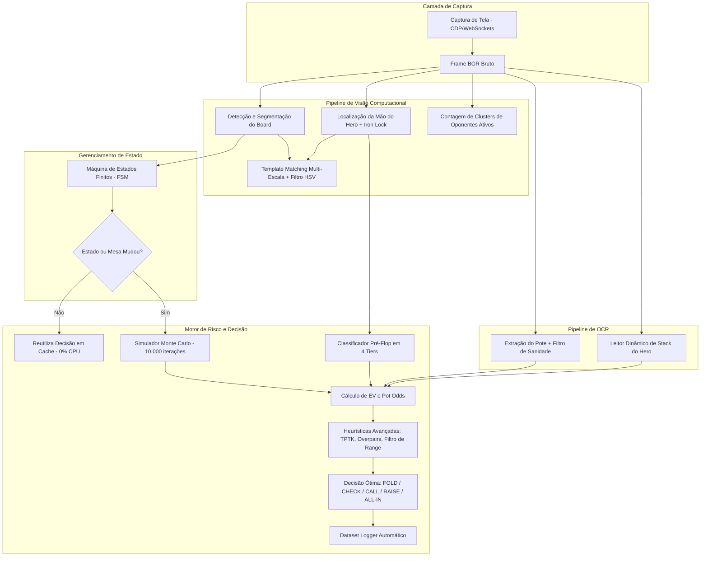

# Real-Time Poker Vision Assistant & Decision Engine (PAE)

[](https://www.python.org/)
[](https://opencv.org/)
[](https://github.com/tesseract-ocr/tesseract)
[](https://numpy.org/)
[](#arquitetura-do-sistema)
[](LICENSE)

Assistente autônomo de visão computacional em tempo real e motor de tomada de decisão com base na Teoria dos Jogos (GTO) para Texas Hold'em.

Construído com **zero invasividade** (captura visual via Chrome DevTools Protocol / CDP Websockets ignorando os bloqueios do Wayland e operando em background), o PAE monitora mesas de poker ao vivo, segmenta cartas comunitárias e da mão do Hero via Template Matching multi-escala, executa OCR em dois estágios para extração de potes e stacks, garante a integridade sequencial do jogo através de uma Máquina de Estados Finitos (FSM) estrita e calcula o Valor Esperado (EV) e Pot Odds em tempo real por meio de simulações de Monte Carlo.

---

## Sumário
- [Principais Funcionalidades](#principais-funcionalidades)
- [Arquitetura Multi-Site](#arquitetura-multi-site-e-rois-dinâmicas)
- [Arquitetura do Sistema](#arquitetura-do-sistema)
- [Estrutura de Diretórios](#estrutura-de-diretórios)
- [Guia de Instalação](#guia-de-instalação)
- [Configuração (.env e sites.json)](#configuração-env-e-sitesjson)
- [Uso e Execução](#uso-e-execução)
- [Licença](#licença)

---

## Principais Funcionalidades

- **Captura Headless (CDP)**: Utiliza Chrome DevTools Protocol para furar completamente as restrições de captura de tela do Wayland, permitindo analisar a aba do jogo em background mesmo encoberta.
- **Detecção Dinâmica de Contornos**: Localização automática das cartas (Board/Hero) via `cv2.findContours` imune a resizes e pequenos scrools de janela.
- **Template Matching Multi-Escala Normalizado**: Reconhecimento dinâmico de Ranks e Naipes testando variações de escala entre 60% e 150%, tornando o sistema imune a diferentes resoluções de tela e densidades de pixel (DPI).
- **Filtro Cromático HSV para Naipes**: Separação matemática rigorosa entre naipes vermelhos (`♥`, `♦`) e pretos (`♠`, `♣`), eliminando confusões visuais.
- **OCR com Binarização de Otsu e Filtro de Contorno**: Leitura numérica precisa do pote e stack do Hero com redimensionamento 2x.
- **Iron Lock Estrito (Trava de Ferro)**: Sistema de retenção de cartas que impede perdas de informações por oscilações transitórias na visão computacional.
- **Ciclo de Vida FSM Estrito**: Garantia de transições sequenciais válidas no Texas Hold'em.
- **Motor Heurístico de Agressividade e Valor (TPTK+)**: Sistema inteligente que recusa Calls "esperançosos", levanta apostas fortes com Top Pair Top Kicker (TPTK) ou Overpairs, e realiza 3-Bet com mãos de Tier 1 no Pré-Flop.
- **Filtro de Range Pós-Flop**: Corta automaticamente 50% da Equity simulada se o Hero possui apenas High Card sem projetos e sofre uma aposta agressiva.
- **Arquitetura Multi-Site**: Configuração externalizada de ROIs (`sites.json`) permitindo mapear qualquer site ou aplicativo de Poker (ReplayPoker, CoinPoker, PokerBros, etc) sem mexer no código Python.
- **Dataset Logger Automático**: Coleta silenciosa de métricas (Pote, Stack, Equity, EV, Ações) na pasta `data/dataset_partidas.csv` para posterior treinamento de Machine Learning.

---

## Arquitetura Multi-Site e ROIs dinâmicas

Com o uso do arquivo `sites.json`, você pode pre-configurar áreas de corte (ROIs) de diversos clientes ou sites de Poker diferentes simultaneamente. O PAE carrega o perfil correto lendo a variável de ambiente `POKER_SITE`.

Exemplo (`sites.json`):
```json
{
  "ReplayPoker": {
    "POT_ROI": { "top": 210, "left": 850, "width": 220, "height": 60 }
  },
  "CoinPoker": {
    "POT_ROI": { "top": 300, "left": 800, "width": 200, "height": 50 }
  }
}
```

---

## Arquitetura do Sistema



---

## Estrutura de Diretórios

```text
POKER/
├── assets/
│   ├── cards/                  # Recortes de cartas processadas (slot_1..slot_5)
│   ├── samples/                # Capturas reais da mesa para validação
│   ├── templates/              # Templates binarizados de Ranks (2..A) e Naipes (s,h,d,c)
│   └── unknown_cards/          # Salvamento automático de cartas não catalogadas
├── data/
│   └── dataset_partidas.csv    # Histórico de jogadas gerado via Logger para IA (git-ignored)
├── docs/
│   └── Documento_Arquitetura_PokerAnalytics.pdf  # Design extendido do sistema
├── scripts/
│   ├── gerar_avatar.py         # Utilitário para gerar avatares e assets secundários
│   └── measure_cards.py        # Ferramenta para medir coordenadas durante a calibração
├── src/
│   ├── config.py               # Configuração global, lendo de sites.json e .env
│   ├── dataset_logger.py       # Gravação em tempo real no CSV de dados da mesa
│   ├── vision/                 # Pipeline visual (Template Matching, detecção, máscara)
│   ├── ocr/                    # OCR do pote e stack (Tesseract)
│   └── engine/                 # Risco, Máquina de Estados (FSM) e Heurísticas
├── tests/                      # Suíte de Testes
│   ├── debug_archive/          # Scripts isolados de debug para uso livre
│   └── test_preflop_and_ocr.py # Testes de sanidade de OCR
├── sites.json                  # Perfis de ROIs da mesa suportando multi-clientes (ReplayPoker, etc)
├── main.py                     # Ponto de entrada (Assistente ao vivo `--live`)
├── requirements.txt            # Dependências Python
└── .env.example                # Variáveis de ambiente configuráveis
```

---

## Guia de Instalação

### Linux (Ubuntu / Debian / Arch)

1. **Instalar dependências de sistema** (Python, Tesseract OCR):
   ```bash
   # Ubuntu / Debian
   sudo apt update
   sudo apt install -y python3 python3-pip python3-venv tesseract-ocr google-chrome-stable

   # Arch Linux
   sudo pacman -S python python-pip tesseract google-chrome
   ```

2. **Inicie o Chrome com porta de depuração aberta (necessário para o Wayland/CDP Capture)**:
   ```bash
   google-chrome --remote-debugging-port=9222 --user-data-dir=$HOME/chrome-poker-bot --remote-allow-origins=*
   ```

3. **Configurar o ambiente virtual Python**:
   ```bash
   cd ~/Projetos/POKER
   python3 -m venv venv
   source venv/bin/activate
   pip install --upgrade pip
   pip install -r requirements.txt
   ```

### Windows

1. **Instalar Python 3.10+** (Marque **Add Python to PATH** na instalação).
2. **Instalar Tesseract OCR**:
   - Baixe o instalador oficial em [UB-Mannheim/tesseract/wiki](https://github.com/UB-Mannheim/tesseract/wiki).
   - Adicione `C:\Program Files\Tesseract-OCR` às Variáveis de Ambiente do Sistema (`PATH`).
3. **Configurar o ambiente virtual no PowerShell**:
   ```powershell
   python -m venv venv
   .\venv\Scripts\Activate.ps1
   pip install --upgrade pip
   pip install -r requirements.txt
   ```

---

## Configuração (.env e sites.json)

A arquitetura usa dois níveis de configuração. O layout de ROIs está no arquivo `sites.json`, mas credenciais de sistema ou parâmetros gerais dinâmicos devem ir no `.env`.

Copie o modelo padrão:
```bash
cp .env.example .env
```

| Parâmetro de Ambiente | Padrão | Descrição |
| :--- | :--- | :--- |
| `POKER_SITE` | `ReplayPoker` | Nome da configuração no `sites.json` a ser mapeada. |
| `HERO_IDENTIFIER` | `The_Ment_End` | Nome do jogador para ancoragem do OCR visual. |
| `POLL_INTERVAL` | `0.5` | Segundos entre cada quadro analisado da mesa. |
| `HEAVY_BET_STACK_RATIO`| `0.40` | Limite (40%) de stack aceitável antes de ativar Folds defensivos. |

---

## Uso e Execução

### Modo Assistente Autônomo ao Vivo (--live)
Acompanha a tela em tempo real com overlay do terminal atualizando probabilidades, EV, Equity, filtragens de range e heurística, decidindo de imediato a sua jogada ótima:

```bash
./venv/bin/python main.py --live
```
*(Para mudar o site, adicione a variável: `POKER_SITE=CoinPoker ./venv/bin/python main.py --live`)*

### Execução dos Testes Unitários
Valida integridade do OCR e detecção de ranges lógicos:
```bash
./venv/bin/python -m unittest discover -s tests
```

---

## Licença

Distribuído sob a Licença MIT. Consulte `LICENSE` para mais detalhes.
